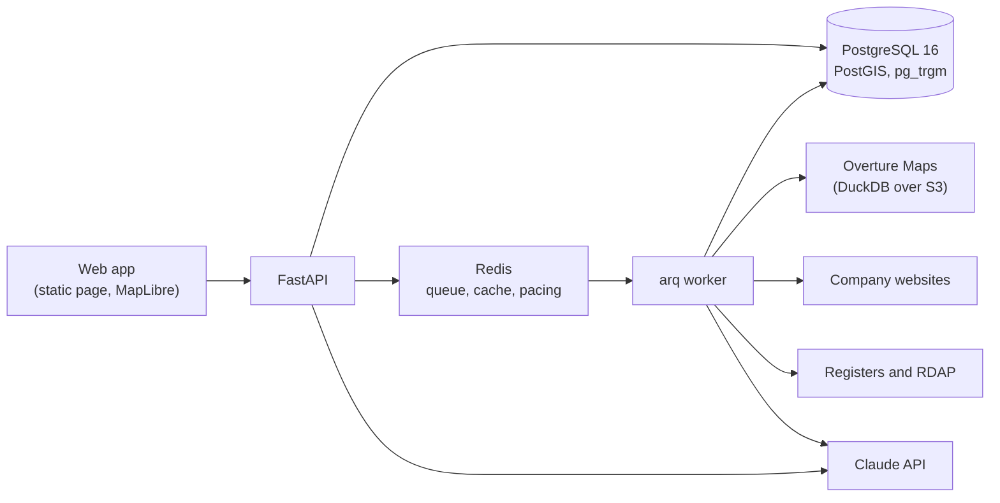

# DealSignal

Finds small businesses worth acquiring (or worth selling to), cleans up what open
data says about them, and ranks them with the reasons shown. Every fact carries its
source, and anything unknown is shown as unknown.

Built for the Caprae Capital Full Stack Developer challenge, as an improvement on
[SaaSquatch Leads](https://www.saasquatchleads.com/).

## Why

Tested against the live SaaSquatch tool on 16 Sep 2026:

| Search | Result |
| --- | --- |
| "HVAC" in Dallas, TX | 8 companies, **0 of them HVAC** (a home-health agency, a lumber yard, an electronics recycler, a garden store, a door supplier, an interior plant service) |
| "Plumbing" in Houston, TX | **1 company**, a pipe-support manufacturer |

Street, phone and rating were `N/A` on every row. Revenue estimation showed a raw
model error inside the data under a green "success" message. Owner lookup returned
"Not Found" and a literal `NaN`. Both enrichment buttons found nothing.

Deal sourcing is not short of data, it is short of **relevant, trustworthy** data.
DealSignal fixes the step where that breaks, then ranks what survives.

## Quick start

Needs Docker Desktop. No API key is needed to explore the demo data.

```bash
git clone https://github.com/bilal-stack/deal-signal.git && cd deal-signal
docker compose up --build -d
docker compose exec api python -m dealsignal.scripts.demo_data load
```

Open **http://localhost:8000**. The API docs are at http://localhost:8000/docs.

The database is migrated automatically when the API starts. The demo data loads in
seconds; building it from the original sources takes about 20 minutes (see
[Loading your own data](#loading-your-own-data)). With `make`: `make up` in one
terminal, then `make demo` in another.

## What is in the demo data

717 real companies from open data, in four metro areas, with 5,530 facts, each
recorded with its source.

| Area | Industries loaded |
| --- | --- |
| Dallas–Fort Worth, TX | HVAC (145), plumbing (102), dental (91) |
| Houston, TX | HVAC (100), plumbing (82) |
| Greater Manchester, UK | HVAC (99), accounting (76) |
| Lyon, France | HVAC (45), plumbing (15) |

- **547** companies dated by when their own website domain was registered.
- **29** Lyon companies matched in the French company register, with **48** directors, 35 of them with a year of birth.
- **1** company read end to end with Claude (A/C Service Co., Fort Worth), to keep API spend down. Its facts, quotes and score are in the data.
- **15** duplicate decisions already made, and **2** pairs left in the review queue: a franchise's two offices, and two surgeons who share one practice website.

The ranked results of five ready-made Buy Boxes are committed as CSV, readable here
on GitHub without running anything:
[HVAC in Fort Worth](apps/api/demo_data/leads/hvac-firms-to-buy-fort-worth.csv) ·
[plumbing in Texas](apps/api/demo_data/leads/plumbing-firms-to-buy-texas.csv) ·
[heating in Lyon](apps/api/demo_data/leads/heating-firms-to-buy-lyon.csv) ·
[accountants in Manchester](apps/api/demo_data/leads/accountancy-practices-to-buy-manchester.csv) ·
[dental practices to sell to](apps/api/demo_data/leads/dental-practices-to-sell-to-fort-worth.csv)

## What it does

1. **Buy Box.** Describe what you are after: industry, country, town, revenue and headcount ranges. Two modes: **acquisition** (owners who may sell) and **sales** (companies likely to buy from you). Several signals invert between them: a stale website is a good sign for a buyer and a bad one for a seller.
2. **Finds real matches.** Places come from Overture Maps, filtered by verified category, so an HVAC search returns HVAC companies.
3. **Reads each website** politely (robots.txt respected, one request a second, up to six pages) and asks Claude for the facts a buyer needs: founding year, owner, family ownership, repeat revenue, business customers, headcount. Each fact must come with the sentence it was taken from.
4. **Adds official records.** The French register gives legal name, founding date, headcount band and directors with their year of birth. Companies House does the same for the UK with a free key. Domain registration dates (RDAP) give a minimum age.
5. **Cleans and merges.** Duplicate listings are joined only when the evidence agrees; doubtful pairs go to a review queue with the reason. Every field keeps every source's answer, and the most trusted one is shown.
6. **Scores 0 to 100** with plain reasons, for example *"Founded 1999 (27 years in business)"*, quoting the website where the fact came from.
7. **Estimates revenue** only from a known headcount, as a range, with the arithmetic shown: *"5 staff (midpoint of the register's 1-9 band) x $150k-$250k revenue per employee"*.
8. **Acts.** Export to CSV or Excel, draft a first message to the owner from public facts only (their own words, never their age or our estimates), track deals on a pipeline board, and keep a do-not-contact list that searches, exports and drafts all respect.

## Using the app

| Tab | What you can do |
| --- | --- |
| **Find companies** | Pick a saved Buy Box or describe a new one, run it, and see results as a ranked list or on a map. Click a company for everything known about it: each field with its source and confidence, the owners and directors, a revenue estimate with its method, and **What we checked**: each lookup that ran and why a field is still empty. From there: add to pipeline, draft outreach, or never contact. |
| **Pipeline** | Move companies through new, contacted, replied, meeting, offer, won or lost, with notes. |
| **Load & enrich** | Load a region and industry from Overture, look companies up in their national register, date their domains, or read their websites. Each job reports what it did, including what failed and why. |
| **Review duplicates** | Decide the pairs the matcher was not sure about: the same business (keeping whichever record's name is right, the practice rather than one of its dentists), or two businesses. |

### API keys

Copy `.env.example` to `.env` and add a key to switch a feature on. Without one, the
feature says plainly that it needs a key.

| Key | Unlocks | Cost |
| --- | --- | --- |
| `ANTHROPIC_API_KEY` | Reading websites, drafting outreach | One Claude call per website or draft. Website batches default to 5 and are capped at 25 per run. |
| `COMPANIES_HOUSE_API_KEY` | UK register lookups: directors and their year of birth | Free |

The French register and RDAP need no key.

## How scoring works

Each Buy Box mode has its own set of signals, and each set adds up to 100 points.

| Acquisition signal | Points | Read from |
| --- | --- | --- |
| Revenue fit | 15 | Revenue estimate vs the Buy Box range |
| Headcount fit | 10 | Stated headcount or register band |
| Recurring revenue | 15 | Website: service plans and maintenance contracts, business customers |
| Years in business | 15 | Register or website founding year; domain age as a lower bound |
| Owner age | 15 | Director's year of birth from the register |
| Independence | 10 | No parent company or corporate director |
| Website freshness | 10 | Last copyright year on the site: a stale site suggests a disengaged owner |
| Family ownership | 5 | Website says it is family owned |
| Single location | 5 | One site is simpler to take over |

Sales mode uses its own set: revenue fit (20), headcount fit (15), business customers
(20), a named contact (20), an active website (15) and multiple locations (10).

**Missing data lowers confidence, never the score.** A signal with nothing to read
abstains; the score is out of the signals that could be read, and **confidence** says
how many that was. A company can score 100 at low confidence because one strong fact is
all that is known about it, so read the two together. With nothing known at all, the
score is blank rather than zero.

## Data sources

| Source | Used for | Notes |
| --- | --- | --- |
| [Overture Maps](https://overturemaps.org) places | Companies, addresses, phones, websites, categories | Read straight from the public S3 dataset with DuckDB. No key. |
| Company websites | Facts with quotes, last copyright year | robots.txt respected, identifying user agent, 1 request/second per site, 6 pages at most. Blocks are recorded, never worked around. |
| [RDAP](https://about.rdap.org) | Domain registration year | Each registry asked directly, found through IANA's bootstrap file. A domain the registry has no record of is reported as probably lapsed. |
| [Recherche d'entreprises](https://recherche-entreprises.api.gouv.fr) (France) | Legal name, founding date, headcount band, directors with year of birth | Official and free. |
| [Companies House](https://developer.company-information.service.gov.uk) (UK) | The same for UK companies | Free key. Not exercised live yet. |
| Revenue benchmarks | Revenue per employee by industry | Documented rules of thumb in [`revenue_per_employee.json`](apps/api/src/dealsignal/data/revenue_per_employee.json), each naming its basis. `scripts/fetch_benchmarks.py` replaces them with US Census figures given a free Census key. |

### Keeping the data honest

- **Unknown stays unknown.** No field is filled with a guess, a zero or `N/A`.
- **Every fact keeps its source**, its confidence and, where there is one, the sentence it came from. When sources disagree, all answers are kept and the most trusted wins: a register beats a website, a newer answer beats an older one.
- **Duplicates are merged on evidence, not hope.** A company's own website, phone and name at one address are strong evidence. A page on a shared host (a site builder, a directory, a social profile, a manufacturer's dealer page, a franchise brand) identifies nobody, so it never causes a merge. Two listings of one website with different names, pages or places go to review instead: that is how a chain, a franchise or a practice of several dentists looks.
- **Failures are reported as failures**, with the reason, in the job results and in each company's "What we checked".

## Architecture



```
apps/api/src/dealsignal/
├── routers/       HTTP only: validate, call one service, shape the response
├── services/      business rules, no framework and no SQL
├── repositories/  all database access, sharing one generic BaseRepository
├── models/        SQLAlchemy tables
├── sources/       one class per external source
├── matching/      normalising, shared hosts, duplicate detection, merge rules
├── scoring/       one class per signal, plus the scorer
├── ai/            Claude calls, schemas and prompts: nothing else calls the SDK
├── workers/       background jobs (arq)
├── scripts/       command-line loads, exports and the demo dataset
└── static/        the web app, served by the API at /app/
```

Dependencies point one way: `routers → services → repositories → models`. A router
validates, calls a service for anything with rules, reads straight from a repository
when there are none, and shapes the response. No SQL and no business rules live in
a router; no framework and no SQL live in a service.

| Layer | Choice |
| --- | --- |
| API | Python 3.12, FastAPI, Pydantic v2, SQLAlchemy 2 (async, asyncpg), Alembic |
| Database | PostgreSQL 16 with PostGIS and pg_trgm |
| Queue, cache, rate limits | Redis 7 and arq |
| Places data | DuckDB reading Overture's GeoParquet files |
| AI | Claude (`claude-opus-5`), structured outputs validated against Pydantic models |
| Web app | One static page in plain JavaScript, MapLibre GL with OpenFreeMap tiles; no build step |
| Runtime | Docker Compose: database, Redis, API, worker |

Design decisions worth knowing:

- **Claude's replies are validated.** The request uses the SDK's structured-output schema and the reply must validate as a Pydantic model; a refusal, a cut-off reply or an unreadable one becomes a plain error, never a half-filled record.
- **Politeness is shared across processes.** Crawl pacing uses a Redis lock per site, so the API and the worker together still send one request a second.
- **Jobs make progress.** Each enrichment attempt is recorded; the next run starts with companies never tried, so companies that can never be completed do not block the rest.
- **One bad record never costs a whole load.** Each record is written in its own savepoint and skipped with a reason if the database refuses it.

## Loading your own data

```bash
# Places for a region and industry (about 30 s to 5 min each)
docker compose exec api python -m dealsignal.scripts.seed --region dallas --industry hvac --limit 150

# Registers, domain ages and websites: or use the Load & enrich tab
docker compose exec api python -m dealsignal.scripts.registry --country FR --limit 25
```

Regions: `dallas`, `houston`, `manchester`, `lyon`. Industries: HVAC, plumbing,
electrical, landscaping, accounting, dental, veterinary, commercial cleaning.

To reset to the demo data: `docker compose exec api python -m dealsignal.scripts.demo_data load --replace`.
To refresh the committed demo data from your database: `... demo_data export`.

## Development

```bash
make test     # pytest: unit and integration
make lint     # ruff and mypy (strict)
make format   # ruff format and autofix
```

- **389 tests.** Unit tests use no network and no database. Integration tests run against a real PostgreSQL in their own `dealsignal_test` database, built by the real migrations, and roll every test back.
- **Tests never call Claude.** Two real replies, each recorded once (a website read and an outreach draft), are replayed through the real SDK from `apps/api/tests/fixtures/claude/`. A test fails if a request schema changes after its recording; re-record with one call each: `python -m dealsignal.scripts.record_website_read --company <id>` or `record_outreach_draft --company <id>`.
- **CI** (GitHub Actions) runs ruff, mypy and the full suite against a real database, and fails if the integration tests are skipped.

### Ports

Postgres is published on **5433** and Redis on **6380**, so a local Postgres or
Supabase on the default ports keeps working. Override with `DB_PORT`, `REDIS_PORT`
and `API_PORT`.

## Limitations and next steps

- **Coverage is uneven by country.** The US has no free national company register, so US owners and their ages are unknown until a website names them; the UK needs a (free) Companies House key.
- **Overture categories are noisy.** A few suppliers and distributors are tagged as HVAC contractors. The matcher cannot tell from the listing alone; reading their websites would.
- **Only one website has been read with Claude** in the demo data, to limit API cost. The job reads more on request.
- **Not built yet:** lookalike search ("find more like this one"; the schema has an embedding column reserved for it), saved searches with alerts, CRM sync, and US state registers.
- **Runs locally.** The containers are ready to host, but the project is meant to run on one machine with one command.

## Ethics and privacy

Open data and official APIs only. robots.txt is respected and the crawler identifies
itself. CAPTCHAs and log-in walls are never bypassed: a blocked site is recorded as
blocked and other sources are used. Personal data is limited to business contacts and
a director's year of birth as published by a public register. The do-not-contact list
is applied to searches, exports and drafts.

## Licence

MIT
